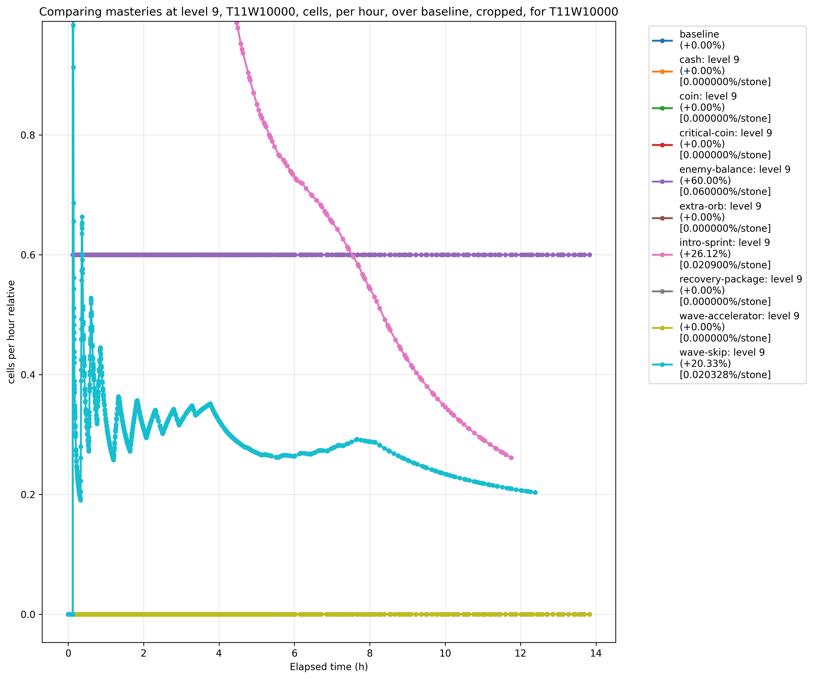
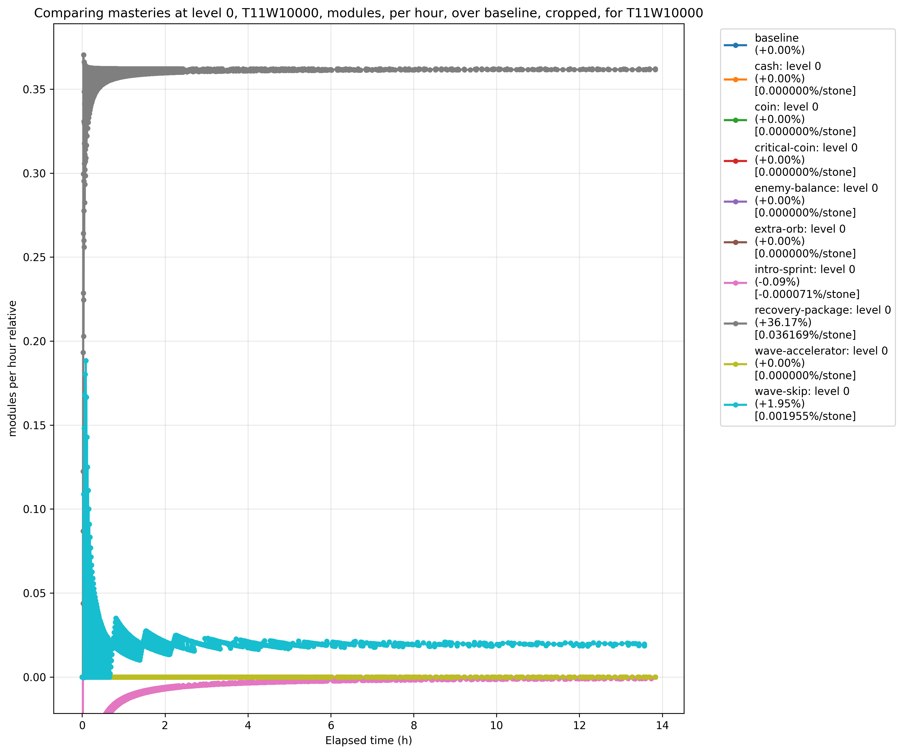

# Mastery Calculator

Calculate the effects of card masteries on cumulative run rewards.

## Usage

### Setup

1. Create and activate a virtual environment:
   ```bash
   python3 -m venv venv
   source venv/bin/activate
   ```

2. Install dependencies:
   ```bash
   pip install -r requirements.txt
   ```

### Generate interesting figures

```
rm -rf ./figures
mkdir ./figures
./render_figures ./figures
```

### Compare different tier:wave combinations

```
./mastery_calc.py tiers TIER:WAVES [ TIER:WAVES... ] [ COMMON_OPTIONS ]
```

### Compare all masteries at the same level

```
./mastery_calc.py compare WAVES [ (--level|-l)=MASTERIES_LEVEL ] [ COMMON_OPTIONS ]
```

### Compare a single mastery at all its levels

```
./mastery_calc.py mastery WAVES MASTERY_NAME [ COMMON_OPTIONS ]
```

### Common option groups

The following options are accepted for `COMMON_OPTIONS`:

Simulation events
```
[ --tier=TIER ] # Which tier to simulate
[ --orb-hits=ORB_HIT_RATIO ] # Portion of enemies struck by orbs
[ --freeup-chance ATK% DEF% UTL% ] # Free upgrade %s chances before perks
[ --package-chance=PKG% ] # Recovery package % chance
[ --bhd=BHD% ] # BHD coin bonus %
[ --golden-combo=GT+% ] # Golden Combo bonus %
```
Tier must be between 1-18, and orb hits must be between 0-1. Both default to 1
if not specified.

Reward normalization
```
[ --reward=( coins | cells | rerolls | modules ) ]
[ --elapsed ]         # Normalize rewards vs elapsed time
[ (--relative|-r) ]   # Divide by baseline values
[ --roi ]             # Divide by stone cost
[ (--difference|-d) ] # Subtract baseline values
```

Output options
```
[ --truncate ] # Truncate horizontally to shortest run
[ --crop ]     # Crop vertically to exclude outliers
[ --no-print ] # Do not print results
[ --no-plot ]  # Do not plot results
[ (--output|-o)=OUTPUT_PNG_PATH ] # Render plot to file
```

Mastery levels
```
[ --cash=CASH_MASTERY_LEVEL ]
[ --coin=COIN_MASTERY_LEVEL ]
[ --critical-coin=CRITICAL_COIN_MASTERY_LEVEL ]
[ --enemy-balance=ENEMY_BALANCE_MASTERY_LEVEL ]
[ --extra-orb=EXTRA_ORB_MASTERY_LEVEL ]
[ --intro-sprint=INTRO_SPRINT_MASTERY_LEVEL ]
[ --recovery-package=RECOVERY_PACKAGE_MASTERY_LEVEL ]
[ --wake-skip=WAVE_SKIP_MASTERY_LEVEL ]
[ --wave-accelerator=WAVE_ACCELERATOR_MASTERY_LEVEL ]
```
Each mastery level accepts the values `locked`, or `0` through `9`. By default,
each option is `locked` if not specified.

## Examples

```bash
# Compare cumulative coin earnings from different length runs on different
# tiers with a custom orb-hit guess. Render the result to PNG file.
./mastery_calc.py waves T10:2000 T6:4000 T2:8000 --orb-hits=0.8 -o plot.png

# Compare cumulative reroll earnings from each mastery at level 2 against a
# baseline of no masteries over a 10k wave run. Show results relative to the
# baseline, normalized by stone cost.
./mastery_calc.py compare 10000 --level=2 --relative --roi --reward=rerolls

# Compare cumulative coins earnings from each level of wave accelerator mastery
# over a 10k wave run with intro sprint mastery level set to 3. Show results
# relative to the baseline.
./mastery_calc.py mastery 10000 wave-accelerator --intro-sprint=3 --relative

# Compare cumulative coin earnings from each mastery at level 9 with custom free
# upgrade chances, BHD bonus, and golden combo bonus. Normalize results relative
# to elapsed run duration. Show results relative to the baseline, normalized by
# stone cost.
./mastery_calc.py compare 10000 --level=9 --elapsed --relative --roi \
  --reward=coins --freeup-chance 89.76 91.46 89.7 --bhd=10 --golden-combo=0.15
```

## Results Analysis

To determine which mastery has the best impact on your economy per stone spent,
you have to simulate farming runs under the different configurations you can
farm, and then compare their results. We'll look at configurations with
different mastery levels and run lengths since those seem to be the most
impactful variables on relative performance.

In our simulations we'll make the assumption that orbs are hitting 100% of
enemies except for scatter children. For an eHP blender build, that's not too
far from reality. However, even if you don't agree with that, you'll see from
the graphs that the orb hit ratio would have to be closer to 50% for Coin# to
even match the benefit of EO#.

### Summary (tl;dr)

So which mastery is best? As with all interesting topics, it depends.

#### Modules and Rerolls

This answer is simple: RPC# and Cash#, respectively.

#### Cells

This answer depends on run length: IS# when under 7000 waves, and EB#
when over.

#### Coins

This answer depends on multiple variables.

Variables:
1. How many mastery lab levels you can afford
2. Long or short run length (over or under 4000 waves)
3. BHD equipped
4. GT+ unlocked

Answers:
- If you can't afford any lab levels or do long farm runs, EO# wins
- If you do short farm runs, IS# wins
- If you use BHD, WS# gets a minor upgrade
- If you use GT+ and do short farm runs, WA# gets a major upgrade

#### Qualitative Properties

RPC# is the only mechanism currently available to shorten the multi-year module
grind. You need an insane number of shards to unlock sub-effect slots
(especially now with assist-mods) that it's difficult to think about RPC# as an
econ mastery, and more of a time-machine mastery.

Likewise, IS# has such a drastic quality of life impact that you may want to
treat it as a completely separate type of mastery and not bother comparing it to
the econ masteries. With IS# you can:
- complete your 3-hour long tournaments will run in 20-30 minutes
- try 6 different tourney builds in an evening
- stop trying to prevent premature kills in early waves
- farm higher tiers in less time

#### Recommended Unlock Order

- Long farm runs:
    - No GT+: RPC#, Cash#, EO#, Coin#, EB#, WS#, WA#, IS#
    - With GT+: RPC#, Cash#, EO#, WA#, EB#, Coin#, WS#, IS#
- Short farm runs:
    - Low income: RPC#, Cash#, IS#, WS#, WA#, EO#, Coin#, EB#
    - High income:
        - No GT+: RPC#, Cash#, IS#, EO#, WS#, WA#, Coin#, EB#
        - With GT+: RPC#, Cash#, IS#, WA#, EO#, WS#, Coin#, EB#

I weigh modules higher than coins, so I rank RPC# and Cash# highest. I also
weigh cells highly, so I promote EB# above several masteries with greater coin
benefits for long runs (where EB# outperforms IS#).

### Mastery Comparison

We'll concentrate our comparative analysis on two different configurations: a
T11 W10000 run, and a T14 W4000 run. Within each configuration, we'll simulate
without any masteries, and then with each mastery individually. We'll do that
for levels 0, 4, and 9 to get a picture of how the effect of a mastery changes
as you level it.

These simulation results will be normalized both by the baseline no-mastery
simulation and the total elapsed time. We can compare those to the same results
normalized once more by stone cost.

> Note that these normalization processes will leave the baseline simulation
> as a flat line (along with any other masteries that have no effect for the
> reward being graphed); while masteries that accelerate certain events will
> appear to have sharp, jagged increases (as they pull farther ahead of the
> baseline) followed by gradual, asymptotic decreases (as the baseline catches
> back up).

#### Cells

Cells are the simplest reward to analyze, so we'll start here.

We see very different stories emerging as we compare T11 and T14 results for
cell rewards. In T11 IS# starts on the bottom at level 0 and climbs its way
right between EB# and WS# after a few levels. In T14, IS# begins with a slight
lead over WS#, and proceeds to drastically overtake EB# and WS#.

However, if we only consider the first half of the T11 graph (40%, actually),
then we see the same relationships as the T14 graph. This difference between our
simulations has nothing to do with the tier, and everything to do with the run
duration. This is a good reminder that our T14 simulation is less than half the
duration of our T11 simulation, which will be the primary differentiator in our
conclusions for each section.

It's also worth pointing out that IS#'s difference between level 0 and 4 is due
to the baseline having a 100 wave sprint duration. While level 0 only increases
that by 80 waves, every level above increases it by 180 waves.

| | Level 0 | Level 4 | Level 9 |
|-|-|-|-|
| Tier 11 |  |  |  |
| Tier 14 |  |  |  |

##### Conclusions

* < 7000 waves: IS# >> EB# > WS#
* \> 7000 waves: EB# > IS# > WS#

#### Modules

Modules are only slightly more complicated than cells because of their
interaction with fleets.

By looking at the figures for each simulation, we can see that RPC# steals the
show. It may be hard to tell, but WS# and IS# are here too. All effects scale
nearly linearly with their level. No other masteries have any impact.

The impact of each mastery is consistent across T11 and T14, save for some blips
you'll see caused by fleets. WS# and IS# get you to fleet spawns sooner, which
gives you a temporary increase over baseline. RPC# loses a tiny bit of its
dramatic lead over baseline any time a fleet spawns.

| | Level 0 | Level 4 | Level 9 |
|-|-|-|-|
| Tier 11 |  |  |  |
| Tier 14 |  |  |  |

##### Conclusions

RPC#

#### Rerolls

Rerolls add another layer of complexity because of the synergy between Cash# and
the masteries that affect elite spawn rates (EB#, WS#, and IS#).

It's worth comparing the effect that each mastery has in isolation to show why
Cash# is so necessary. Conversely, it's not very helpful to view the effect of
the other masteries without a base assumption of Cash# at least being unlocked
at level 0.

Our T14 simulation exhibits interesting jagged lines that correspond to fleet
spawns. IS# and WS# get you to the fleet's wave sooner, and give you a temporary
lead over the baseline. This corrects after the baseline reaches that same wave,
and would have in our graphs if our simulation didn't end just before that wave.

However, Cash# has a persistent dip in its relative performance at these fleet
spawning waves because the baseline also gets them at the same time. Since the
fleet reward is so significant, adding it to both simulations noticeably closes
the gap (especially in shorter runs).

| | Level 0 | Level 4 | Level 9 |
|-|-|-|-|
| Tier 11 (no Cash#) |  |  |  |
| Tier 11 (Cash#0) |  |  |  |
| Tier 14 (no Cash#) |  |  |  |
| Tier 14 (Cash#0) |  |  |  |

##### Conclusions

* < 7000 waves: Cash# >> WS# >= IS# >= EB#
* \> 7000 waves: Cash# >> WS# >= EB# >= IS#

#### Coins

Coins are the complicated case, so strap in. There are seven different masteries
that impact coin income, and some of them have interactions with BHD and GT+
that are significant enough to dive into separately.

The first thing we have to address is how IS# skews the graphs. IS# is the clear
overachiever of the group. Though notably its advantages fall away rapidly after
about 3000 waves. To make the relationships between the other masteries more
visible, we've included graph variants without IS#.

In addition to IS#, run length has a serious impact on the performance of WA#
and WS#, and a minor impact on EO#, EB#, and CritCoin#. WA# and WS# both lose
their early advantages around 3000 waves. WA# and IS# continue to degrade
rapidly, while EO#, WS#, and CritCoin# all degrade slowly. EB#, conversely,
improves rapidly up until 3000 waves, then slowly after.

While mastery level doesn't have an apparent relative impact on EO#, Coin#, EB#,
and CritCoin#, there is a significant difference between level 0 and 4 for IS#,
WA#, and WS#. WA# and WS# degrade compared to the others, while IS# improves.
However, there's virtually no difference for any mastery between levels 4 and 9.

There's a big asterisk on EO#, which is that it won't perform as well for high
damage builds since enemies often get killed before they reach the orb line. If
you farm a basic eHP blender, then you should still see the calculated benefit.

| | Level 0 | Level 4 | Level 9 |
|-|-|-|-|
| T11 |  |  |  |
| T11 (no IS#) |  |  |  |
| T14 |  |  |  |
| T14 (no IS#) |  |  |  |

##### BHD

BHD amplifies the benefit of WS# because free upgrade quantities are accumulated
during wave skips. This benefit increases with mastery level, and remains
consistent in the face of changing run length.

We can also observe that BDH has some impact on IS# when we assess high mastery
levels. BHD affects IS# because IS# increases the impact of any coin multiplier
increase by accelerating the spawn rate. This impact becomes significant during
short runs.

| | None (0%) | Epic (3%) | Legendary (5%) | Mythic (7%) | Ancestral (10%) |
|-|-|-|-|-|-|
| T11 L2 |  |  |  |  |  |
| T11 L9 |  |  |  |  |  |
| T14 L2 |  |  |  |  |  |
| T14 L2 (no IS#) |  |  |  |  |  |
| T14 L9 |  |  |  |  |  |
| T14 L9 (no IS#) |  |  |  |  |  |

##### Golden Combo (GT+)

GT+ amplifies the benefit of EB#, IS#, WA#, and WS#; but diminishes the relative
benefit of CritCoin# and EO#. Both the positive and negative effects grow as a
function of mastery level and run length.

GT+ has a fairly consistent effect on IS# and WS# across tiers and mastery
levels. It has a major effect on EB# and WA#, though with opposite affinities
for run length. We've omitted IS# from the T14 graphs because GT+'s impact is so
minor compared to others, and IS# skews the graphs.

| | 0.00% | 0.15% | 0.30% | 0.45% |
|-|-|-|-|-|
| T11 L2 |  |  |  |  |
| T11 L9 |  |  |  |  |
| T14 L2 (no IS#) |  |  |  |  |
| T14 L9 (no IS#) |  |  |  |  |

##### BHD with GT+

BHD and GT+ each make significant changes to several masteries, but synergize to
greatly amplify WS# when used together. These graphs give you an idea of exactly
how impactful that synergy is relative to the improvements they make to those
other masteries. Once again, we include graph variants without IS#.

| BHD 7% | GT+ 0.00% | GT+ 0.15% | GT+ 0.30% | GT+ 0.45% |
|-|-|-|-|-|
| T11 L2 |  |  |  |  |
| T11 L9 |  |  |  |  |
| T14 L2 |  |  |  |  |
| T14 L2 (no IS#) |  |  |  |  |
| T14 L9 |  |  |  |  |
| T14 L9 (no IS#) |  |  |  |  |

##### Conclusions

Since there is so much nuance to how our variables affect each mastery, we don't
have a simple conclusion based on run length. Instead, we have a decision tree
based on the following questions:
1. How many mastery lab levels can you afford if you saved coins for a week?
    - None at all (L0)
    - A couple levels (L2)
    - All the levels (L9)
2. Are your farm runs short or long (<4000 waves)?
    - Short
    - Long
3. Do you have BHD? (y/n)
4. Do you have GT+? (y/n)

Fortunately, something we can all agree on is that CritCoin# is always the worst
choice, so I'll be omitting if from the table below.

| 1 | 2 | 3 | 4 | |
|-|-|-|-|-|
| L0 | * | * | No GT+ | EO# > WS# > [Coin# = WA#] > [IS# = EB#] |
| L0 | * | * | Yes GT+ | EO# > [WS# = WA#] > Coin# > IS# > EB# |
| L2 | Long | * | No GT+ | EO# > [Coin# = IS# = WS#] > WA# > EB# |
| L2 | Long | No BHD | Yes GT+ | EO# > WA# > [Coin# = IS# = WS#] > EB# |
| L2 | Long | Yes BHD | Yes GT+ | EO# > WA# > WS# > [Coin# = IS#] > EB# |
| L2 | Short | No BHD | No GT+ | IS# >> EO# > [WS# = WA#] > Coin# > EB# |
| L2 | Short | Yes BHD | No GT+ | IS# >> EO# > WS# > WA# > Coin# > EB# |
| L2 | Short | * | Yes GT+ | IS# >> WA# > EO# > WS# > Coin# > EB# |
| L9 | Long | No BHD | No GT+ | EO# > [IS# = Coin#] > WS# > [WA# = EB#] |
| L9 | Long | No BHD | Yes GT+ | EO# > IS# > [Coin# = WS#] > [WA# = EB#] |
| L9 | Long | Yes BHD | No GT+ | EO# > [IS# = Coin# = WS#] > [WA# = EB#] |
| L9 | Long | Yes BHD | Yes GT+ | EO# > IS# > WS# > Coin# > [WA# = EB#] |
| L9 | Short | No BHD | No GT+ | IS# > EO# > [WS# = WA#] > Coin# > EB# |
| L9 | Short | No BHD | Yes GT+ | IS# > WA# > EO# > WS# > Coin# > EB# |
| L9 | Short | Yes BHD | No GT+ | IS# >> EO# > WS# > WA# > Coin# > EB# |
| L9 | Short | Yes BHD | Yes GT+ | IS# >> WA# > [EO# = WS#] > Coin# > EB# |

To try to summarize:
- If you can't afford any lab levels or do long farm runs, EO# wins
- If you do short farm runs, IS# wins
- If you use BHD, WS# gets a minor upgrade
- If you use GT+ and do short farm runs, WA# gets a major upgrade

### Tier Comparison

To determine if certain mastery combos make higher-tier farming more viable,
we'll compare runs across T11-T14 to each other with varying mastery levels.
T11 is simulated for 10000 waves, and each higher wave is 2000 waves shorter
than the previous. For each reward, we'll compare simulations with no masteries,
with masteries at level 0, and then at level 9.

Simply unlocking masteries is not going to make higher-tier farming any more
viable than it already is, as evidenced by the near-identical graphs in the
Locked and Level 0 columns. However, by level 9, the synergizing mastery combos
have more than compensated for the shorter runs. This makes higher-tier farming
not only viable, but preferred.

The notable exception to this pattern is module farming, which is so completely
dominated by RPC# that there's essentially no benefit gained from higher tiers
if farming runs are at all shortened.

| | Locked | Level 0 | Level 9 |
|-|-|-|-|
| Coins |  |  |  |
| Cells |  |  |  |
| Rerolls |  |  |  |
| Modules |  |  |  |

##### Conclusions

IS#, WA#, Cash#, and EB# synergize to make higher-tier farming viable at about
mastery level 4.

## Estimation methodology

Runs are simulated sequences of waves, emitting events as probabilities. Rewards
are calculated each wave by multiplying the event probabilities to the results
of encountering each event. Rewards are accumulated over the run and tracked as
cumulative values per-wave. The results can be thought of as numerical integrals.

Results for different simulation configurations can
be directly compared and plotted against each other, either as absolute values,
normalized values relative to a baseline simulation, or the difference of values
from the target simulation and the baseline simulation. Relative values can
further be normalized against the stone-cost of their mastery.

This tool should produce accurate estimates of the instances of each event if
compared to real runs of the game. However, the rewards for those events are not
expected to be accurate relative to the real game. They are instead expected to
be accurate relative to each other ("internally consistent"). This is because
the tool does not model the effects of certain multipliers or effects that apply
consistently across a run. For example, econ-based UW bonus and uptime provide a
consistent boost to rewards when they apply, and over a long-enough run, they
will apply to a statistically consistent portion of the run. Factoring them in
would therefore have no effect on the relative benefits of different masteries,
and so is not beneficial to model.

### Known limitations

- Waves are modeled atomically, assuming that all enemies spawned in the wave
  are killed during that wave, and that no enemy lives long enough to have its
  coin rewards reduced by staleness.
- The effect of Golden Combo (GT+) is approximated by ignoring GT duration and
  cooldown. We assume that all enemies spawned in the current and previous waves
  contribute to the current wave's golden combo bonus.
- The effect of Black Hole Digestor (BHD) is approximated by estimating the
  probability of sequential wave skips back by 10 waves, and by ignoring the
  fact that WS# has a larger impact on sequential wave skips than it does on
  average wave skips.

### Future work

- Add a "difficulty" simulation type that models the expected maximum wave count
  you can reach across different tiers based on your highest wave on a baseline
  tier. Factor in enemy level skips and enemy health/attack scaling across
  tiers, assuming that reaching the same aggregate level of enemy health/attack
  will terminate the run at each tier. Consider the number of enemy spawns to
  calculate this aggregate value.

## Validation strategy

Lacking a mechanism to scientifically compare results of gameplay with different
mastery configurations or ground-truth data from the developer, our ability to
validate simulation results is limited to comparison of each configuration
against the integral of model equations. Deriving these functions requires
analysis of the sources of each in-game reward and the probabilities of the
events that yield them.

While the graph of the total rewards earned with a given configuration can
sometimes show the impact of a mastery, it is often more beneficial to graph the
quotient of relative rewards between mastery and baseline plots, or the
difference between them.

### Modeling techniques

Simulation of each wave produces a vector of probabilistic events and a
resulting vector of rewards derived from those events. Results from each wave
are summed over the course of the run, thereby approximating the integral of the
per-wave rewards. The limits of integration are the waves simulated.
We make the following definitions:
- `e(w)`: the function of event probability vectors for a given wave `w`
- `r(w)`: the function of per-event rewards for a given wave `w`
- `e(w) * r(w)`: the piecewise product of event probability and event rewards
- `f(w)`: `e(w) * r(w)`
Then the cumulative reward is `∫{a,b} f(w) dw`

However, our goal is to model rewards with respect to time, not waves. So we
have to transform from any given range of time to the corresponding range of
waves. The limits of integration are the time points of the wave simulated.
- `t(w)`: the function transforming wave numbers to time points
- `w(t)`: the function transforming time points to wave numbers
- `e(t)`: `e(w(t))`
- `r(t)`: `r(w(t))`
- `f(t)`: `e(t) * r(t)`
Then the cumulative reward is `∫{a,b} f(t) dt`

Masteries produce altered versions of the above functions. To demonstrate the
impact each mastery should have, we first have to define these functions for the
baseline configuration with no masteries. Then we can highlight per-mastery
differences, and derive the expected mastery models.

## Estimation models

- During intro sprint, waves advance at 10x the speed via repeated 9x wave skips
  and reward drop rates are altered.
  - Intro sprint lasts until wave `100`, unless extended by IS#.
  - Intro sprint is modeled as a piecewise function with separate domains from
    waves `[1,100)` to `[100,+inf)`:
    - `t(w) = w|{0,100}:0.1; {100,*}:1| * (WaveDuration + WaveCooldown)`
    - `w(t) = t|{0,t(100)}:10; {t(100),*}:1| / (WaveDuration + WaveCooldown)`
    - `f(w) = e(w) * w|{0,100}:IS_Factor; {100,*}:1| * r(w)`
- Wave skip reduces the amount of time spent on a wave to 0, and alters the
  rewards from a wave to the scaled value of rewards of the previous wave.
  - Wave skip is modeled as:
    - a constant scale factor to `w(t)` (by default, 0.19, but increased by WS#)
      - `w(t) = (WaveDuration + WaveCooldown) * (1 - WS_Chance)`
    - an interpolation by that scale factor between the current wave's rewards
      and a scaled value of the previous wave's rewards; if we assume those are
      approximately equal:
      - `f(w) = (1 - WS_Chance) * (e(w) * r(w)) + WS_Chance * (e(w) * r(w)) * WS_Bonus`
      - `f(w) = e(w) * r(w) * (1 + WS_Chance * (WS_Bonus - 1))`

### Coins

Coins are dropped by all enemies except bosses.

- `e(w) = w|{0,100}:0.1; {100,*}:1.0| * <BasicSpawnChance(w),...,EliteSpawnChance(w)>`
- `r(w) = w|{0,100}:0; {100,*}:1| * <0.33,...,4.0>`

Masteries that affect coin income are Coin#, CritCoin#, EB#, EO#, IS#, WA#, and
WS#.

#### Coin#

Coin# increases all coin rewards:
- `r'(w) = w|{0,100}:0; {100,*}:1| * <0.33,...,4.0> * Coin#`

This results in a linear increase in coin income:
- Absolute: the exponential and linear components of the curve have higher
  coefficients, scaling them vertically
- Relative: the ratio to baseline is a constant, which make horizontal lines of
  form `y = k * Coin#`
- Difference: the difference between functions accelerates towards a linear
  equation of the form `y = k * Coin# * t`

#### CritCoin#

CritCoin# increases coin rewards for basic enemies:
- `r'(w) = w|{0,100}:0; {100,*}:1| * <0.33,...,4.0> * <CritCoin#,...,1>`

This results in a linear increase in coin income:
- Absolute: the curve is translated in y+
- Relative: the ratio to baseline is a positive horizontal asymptote decreasing
  toward the line `y = k * CritCoin#`
- Difference: the difference between functions is a linear equation of the form
  `y = k * CritCoin# * t`

#### EB#

EB# increases the effective elite spawn chance:
- `EliteSpawnChance'(w) = EliteSpawnChance(w) * EB#`

This results in a linear increase in cell income:
- Absolute: the curve has a higher coefficient, and is scaled vertically
- Relative: the ratio to baseline is a constant, which make horizontal lines of
  form `y = k * EB#`
- Relative: the ratio to baseline is approximately linear until elite spawns max
  out, then asymptotically approaches a horizontal line of the form
  `y = k * EB#`
- Difference: the curve accelerates toward a linear equation of the form
  `y = k * EB# * t`

#### EO#

EO# increases all coin rewards for enemies hit by orbs:
- `r'(w) = w|{0,100}:0; {100,*}:1| * <0.33,...,4.0> * EO#`
In practice, this will be most enemies except for all scatter splits, which
represent a more-significant portion of enemies early on in a run. That causes
the relative graph to follow an asymptote instead of a plain horizontal line.

This results in a linear increase in coin income:
- Absolute: the exponential and linear components of the curve have higher
  coefficients, scaling them vertically
- Relative: the ratio to baseline is a positive horizontal asymptote
  approaching the line `y = k * EO#`
- Difference: the difference between functions accelerates towards a linear
  equation of the form `y = k * EO# * t`

#### IS#

IS# extends the period of 0% coin drop rate, but shifts the enemy spawn tables
in -t:
- `e'(w) = w|{0,i}:0.1; {i,*}:1.0| * <BasicSpawnChance(w),...,EliteSpawnChance(w)>`
- `w'(t) = t|{0,t(i)}:10; {t(i),*}:1| / (WaveDuration + WaveCooldown)`

This results in a constant increase in coin income:
- Absolute: the curve is translated in -t and -y, crossing the y-axis later, but
  reaching maximum slope sooner
- Relative: the ratio to baseline begins following an increasing horizontal
  asymptote, then transitions to a decreasing horizontal asymptote approaching
  the line `y = k * IS#`
- Difference: the difference between functions is approximately linear until
  reaching max enemy spawn rate, then smooths out to the horizontal line
  `y = k * IS#`

#### WA#

WA# compresses the common enemy spawn table in t:
- `e'(w) = w|{0,100}:0.1; {100,*}:1.0| * <BasicSpawnChance(w * WA#),...>`

This results in a constant increase in coin income:
- Absolute: the exponential portion of the curve is scaled in y
- Relative: the ratio to baseline begins following an increasing horizontal
  asymptote, then transitions to a decreasing horizontal asymptote approaching
  the line `y = k * (1 - WA#)`
- Difference: the difference between functions is approximately linear until
  reaching max enemy spawn rate, then smooths out to the horizontal line
  `y = k * (1 - WA#)`

#### WS#

WS# increases the effective wave skip chance:
- `WS_Chance' = (WS_Chance * WS#) + WS_Chance * (1 - WS_Chance * WS#)`
- `f'(w) = e(w) * r(w) * (1 + WS_Chance' * (WS_Bonus - 1))`
- `w'(t) = w(t * WS#)`

This results in a linear increase in coin income:
- Absolute: the curve is compressed in t and dilated in y
- Relative: the ratio to baseline is a choppy positive horizontal asymptote
  decreasing towards `y = WS#`
- Difference: the difference between functions is approximately linear,
  following the line `y = k * WS# * t`

### Elite Cells

Elite cells are dropped by elite enemies.

- `e(w) = w|{0,100}:0.1; {100,*}:1.0| * EliteSpawnChance(w)`
- `r(w) = w|{0,100}:0.2; {100,*}:1.0| * avg(TierCellMin, TierCellMax)`

Masteries that affect cell income are EB#, IS#, and WS#.

#### EB#

EB# increases the effective elite spawn chance:
- `EliteSpawnChance'(w) = EliteSpawnChance(w) * EB#`

This results in a linear increase in cell income:
- Absolute: the curve has a higher coefficient, and is scaled vertically
- Relative: the ratio to baseline is a constant, which make horizontal lines of
  form `y = k * EB#`
- Difference: the difference between functions accelerates towards a linear
  equation of the form `y = k * EB# * t`

#### IS#

IS# extends the 20% cell drop rate and 10x elite spawn table advancement
periods, and shifts the elite spawn table in -t:
- `e'(w) = w|{0,i}:0.1; {i,*}:1.0| * EliteSpawnChance(w)`
- `r'(w) = w|{0,i}:0.2; {i,*}:1.0| * avg(TierCellMin, TierCellMax)`
- `w'(t) = t|{0,t(i)}:10; {t(i),*}:1| / (WaveDuration + WaveCooldown)`

This results in a constant increase in cell income:
- Absolute: the curve is translated in X- significantly and Y- slightly
- Relative: the ratio to baseline is a positive horizontal asymptote at
  decreasing towards `y = 0`
- Difference: the difference between functions is exponential during the
  exponential phase, then constant during the linear phase, resulting in an
  S-curve

#### WS#

WS# increases the effective wave skip chance:
- `WS_Chance' = (WS_Chance * WS#) + WS_Chance * (1 - WS_Chance * WS#)`
- `f'(w) = e(w) * r(w) * (1 + WS_Chance' * (WS_Bonus - 1))`
- `w'(t) = w(t * WS#)`

This results in a linear increase in cell income:
- Absolute: the curve is compressed in t and dilated in y
- Relative: the ratio to baseline is a choppy positive horizontal asymptote
  decreasing towards `y = WS#`
- Difference: the difference between functions is exponential during the
  exponential phase, then linear during the linear phase

### Reroll Shards

Reroll shards are dropped by bosses.

- `e(w) = w|{0,100}:0; {100,*}:1| / TierBossPeriod`
- `r(w) = w|{0,100}:0; {100,*}:1| * TierRerollDrop`

Masteries that affect reroll shard income are Cash#, EB#, IS#, and WS#.

#### Cash#

Cash# adds a chance for elites to drop half as many reroll shards as bosses:
- `e(w) = w|{0,100}:0; {100,*}:1| * <TierBossPeriod,EliteSpawnChance(w)>`
- `r(w) = w|{0,100}:0; {100,*}:1| * <1.0,0.5> * TierRerollDrop`

This results in additional reroll rewards that follow an exponential curve until
elite spawns max out, after which they follow a linear curve:
- Absolute: the curve accelerates toward a scaled linear equation
- Relative: the ratio to baseline is approximately linear until elite spawns max
  out, then asymptotically approaches a horizontal line of the form
  `y = k * Cash#`
- Difference: the curve accelerates toward a linear equation of the form
  `y = k * Cash# * t`

#### EB#

EB# increases the effective elite spawn rate. With Cash#, this scales the number
of elites that can drop reroll shards:
- `EliteSpawnChance'(w) = EliteSpawnChance(w) * EB#`
- `e(w) = w|{0,100}:0; {100,*}:1| * <TierBossPeriod,EliteSpawnChance'(w)>`

This results in a constant scale factor to the increased rewards from Cash#:
- Absolute: the curve accelerates toward a scaled linear equation
- Relative: the ratio to baseline is approximately linear until elite spawns max
  out, then asymptotically approaches a horizontal line of the form
  `y = k * EB#`
- Difference: the curve accelerates toward a linear equation of the form
  `y = k * EB# * t`

#### IS#

IS# extends the period of 0% reroll shard drop rate, but shifts the elite spawn
table in -t. With Cash#, this increases reroll shard drop rate from more elites:
- `e'(w) = w|{0,i}:0; {i,*}:1| * EliteSpawnChance(w)`
- `w'(t) = t|{0,t(i)}:10; {t(i),*}:1| / (WaveDuration + WaveCooldown)`

This results in a constant increase in reroll income:
- Absolute: the curve is translated in -t and -y, crossing the y-axis later, but
  reaching maximum slope sooner
- Relative: the ratio to baseline begins following an increasing horizontal
  asymptote, then transitions to a decreasing horizontal asymptote approaching
  the line `y = k * IS#`
- Difference: the difference between functions is approximately linear until
  reaching max elite spawn rate, then smooths out to the horizontal line
  `y = k * IS#`

#### WS#

WS# increases the effective wave skip chance:
- `WS_Chance' = (WS_Chance * WS#) + WS_Chance * (1 - WS_Chance * WS#)`
- `f'(w) = e(w) * r(w) * (1 + WS_Chance' * (WS_Bonus - 1))`
- `w'(t) = w(t * WS#)`

This results in a linear increase in reroll shard income:
- Absolute: the curve is compressed in t and dilated in y
- Relative: the ratio to baseline is a choppy positive horizontal asymptote
  decreasing towards `y = WS#`
- Difference: the difference between functions is approximately linear,
  following the line `y = k * WS# * t`

### Module Shards

Reroll shards are dropped by bosses.

- `e(w) = w|{0,100}:0; {100,*}:1| * <CommonModuleChance,RareModuleChance> / TierBossPeriod`
- `r(w) = <10,30>`

Masteries that affect module shard income are RPC#, IS#, and WS#.

#### RPC#

RPC# alters adds a new event that can drop common modules:
- `e(w) = w|{0,100}:0; {100,*}:1| * RecoveryPackageChance * <RPC#,0>`

This results in a consistently linear increase in module income.
- Absolute: the curve has a higher coefficient, and is scaled vertically
- Relative: the ratio to baseline is a constant, which make horizontal lines of
  form `y = k * RPC#`
- Difference: the difference between functions is a linear equation of the form
  `y = k * RPC# * t`

#### IS#

IS# extends the period of 0% module drop rate:
- `e'(w) = w|{0,i}:0; {i,*}:1| * <CommonModuleChance,RareModuleChance>`
- `w'(t) = t|{0,t(i)}:10; {t(i),*}:1| / (WaveDuration + WaveCooldown)`

This results in a constant decrease in cell income:
- Absolute: the curve is translated in X+ by `IS# - 100`
- Relative: the ratio to baseline is a positive horizontal asymptote
  increasing toward `y = 0`
- Difference: the difference between functions is constant, which make
  horizontal lines of the form `y = k * IS# / 100`

#### WS#

WS# increases the effective wave skip chance:
- `WS_Chance' = (WS_Chance * WS#) + WS_Chance * (1 - WS_Chance * WS#)`
- `f'(w) = e(w) * r(w) * (1 + WS_Chance' * (WS_Bonus - 1))
- `w'(t) = w(t * WS#)`

This results in a linear increase in cell income:
- Absolute: the curve is compressed in t
- Relative: the ratio to baseline is a choppy positive horizontal asymptote
  decreasing towards `y = WS#`
- Difference: the difference between functions is a linear equation of the form
  `y = k * WS# * t`
